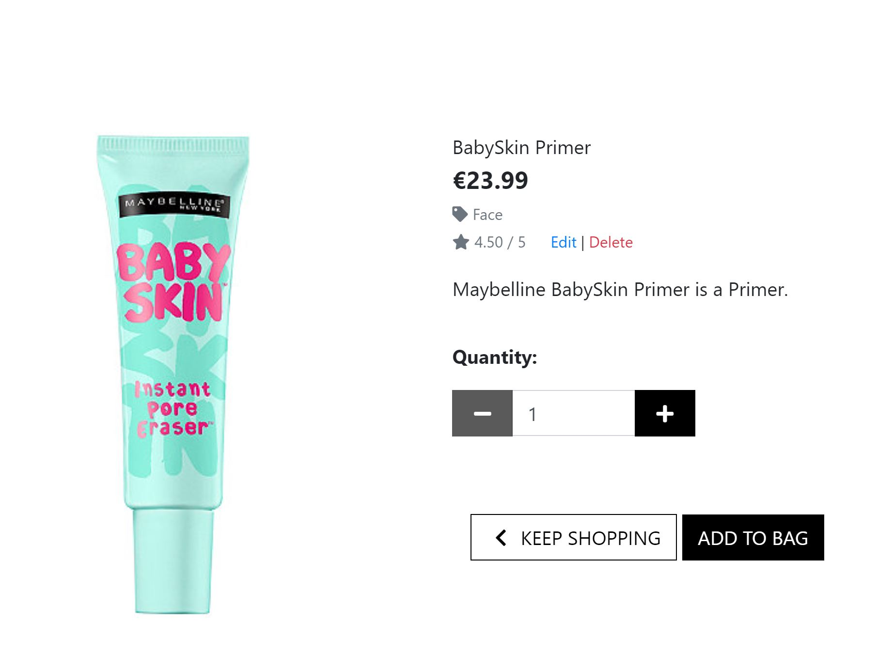

# Ellie Face - Commerce Web Store

## Table of Contents

* [Project Summary](#project-summary)
* [User Experience Design (UX)](#user-experience-design)
  * [The Strategy Plane](#the-strategy-plane)
    * [User Stories](#user-stories) 
  * [The Scope Plane](#the-scope-plane)
  * [The Structure Plane](#the-structure-plane)
  * [The Skeleton Plane](#the-skeleton-plane)
    * [Wireframes](#wireframes)
    * [Database Design](#database-design)
    * [Security](#security)
  * [The Surface Plane](#the-surface-plane)
* [Features](#features)
   * [Existing Features](#existing-features)
   * [Future Features](#future-features)
* [Technologies](#technologies)
* [Testing](#testing)
* [Deployment](#deployment)
    * [AWS S3](#aws-s3)
    * [Heroku Deployment](#heroku)
    * [Local Deployment](#local-deployment)
* [Credits](#credits)

****

# Project Summary

The goal of this project was to create a fully functioning e-commerce personal care website that allows customers to purchase products with Stripe. In addition the application provides the functionality that allows the Superuser/Admin to add, edit and delete products and add and edit blog posts. These actions can be done through Django admin site. 

Customers can also create accounts that allow them to store their delivery details and also allows them to see their order history.

Ellie Face is an online skincare and makeup e-commerce store. The store also has a blog page with skincare tips and advice.

The live website can be found [here](https://ellie-face.herokuapp.com/)

# User Experience Design

## The Strategy Plane

Ellie Face is an e-commerce site, dominated in Euro and based in Ireland. It sells a curated range of skincare and makeup products.

## User Stories

As an e-commerce site owner...

* I want to offer a curated array of products that are displayed in a visually appealing manner and an easy to navigate shopping journey that ensures that customers have a good user experience. 
* I want to provide valuable information to users in relation to skincare so that they will return to the store to make repeat purchases.
* I want to be able to add, edit and adjust blog posts to both provide information and improve the site’s SEO.
* I want to be able to add and amend stock items when I need to.
* I want to offer a shopping journey that is informative and easy to navigate through.

As a customer...

* I want the main purpose of the site to be clear so that I immediately know what the site is intended for upon entering.
* I want to be able to find the products I want quickly and easily so I can complete my purchases.
* I want be able to see products ratings to I can make informed purchase decisions.
* I want to easily view the total of my purchases at any time and have the option to update or delete.
* I want to successfully register for an account and proceed to log in.
* I want to easily access my previous orders.
* I want to be able to store my shipping details so that it’s easier for me to check out.
* I want to search for individual products to save time a list of products or look for an individual item by its category.

## The Scope Plane 

In designing the page, I wanted it to be immediately clear what the purpose of the site is. The SHOP NOW button on the hero image achieves this, along with easy search in the header. 

### Features planned:

* Separate navigation bars for desktop and mobile devices. 
* Responsive Design - Site should be responsive on all devices. 
* On entering the homepage it will immediately clear what the purpose of the site is.
* Standard e-commerce feed of products with the option to sort products and filter them by category name. 
* Clear and obvious call to action buttons with a shop now button on the home page along with links to purchase the bestselling products.
* Blog page – useful and information skincare advice which will be added to on a regular basis.
* Contact form –so customers can contact the site owner by email directly in the site.
* Product ratings  - so customers can make informed purchase decisions.
* About page – providing users with an element of trust and transparency that there are people being the technology.

## The Structure Plane

When the user arrives on site, they will see the hero image and text which 
On entering the site, users are greeted with a colourful hero image of a lady with great skin. To the left of the image is a shop now button allowing customers to start shopping immediately if they wish.
Below this there are some images of the bestselling products, along with the prices for transparency.
Search and filter features on the top of every page allow customers to quickly and easily find the products they are looking for.

The products in the shop are divided into relevant categories, namely, face, eye and lips which makes it easier to find products. Customers are view the full details of any product by clicking on the product in the shop. Details include the name, description, image, price and rating.

Once customers add products to their cart, this cart will be visible at all times in the top right hand corner of the site. It will also display the current cart total in Euro.

Handy message notifications will also appear in the top right hand corner when a customer performs an action such as adding something to their cart, removing it etc.

Secure checkout has been implemented using Stripe and customers are redirected to a checkout form page when they are ready to pay.

The about page explains a little about the owners of the website with a paragraph to left of the image of the owners. The blog page contains a list of blogs with links on each to read more. The contact form contains a simple form allowing customers to email the site owners with any questions.

## The Skeleton Plane

### Wireframes

Balsamiq was used to create wireframes for the site. These are be found [here](readme/wireframes).

The initial wireframes consisted of 10 pages and wireframes were created from desktop, mobile and tablet.
 

### Database Design

As Django works with SQL databases by default, I was using SQLite in development. Heroku, however, provides a PostgreSQL database for deployment

### User Model

The User model utilized for this project is the standard one provided by `django.contrib.auth.models`

### Profiles App

| Name | Database Key | Field Type | Type Validation |
| :-------------: |:----------------:| :--------------: | :---------: |
|User | user |	OneToOneField 'User'| on_delete=models.CASCADE
|Default Phone Number |	default_phone_number | CharField | max_length=20, null=True, blank=True
|Default Country | default_country | CountryField | blank_label='country', null=True, blank=True
|Default Postcode | default_postcode | CharField | max_length=20, null=True, blank=True
|Default Town or City | default_town_or_city | CharField | max_length=40, null=True, blank=True
|Default Street Address1 | default_street_address1 | CharField | max_length=80, null=True, blank=True
|Default Street Address2 | default_street_address2 | CharField | max_length=80, null=True, blank=True

### Products App

`Category` model

| Name | Database Key | Field Type | Type Validation |
| :-------------: |:----------------:| :--------------: | :---------: |
|Name | name | CharField | max_length=254
|Friendly Name | friendly_name | CharField | max_length=254, null=True, blank=True

`Product` model

| Name | Database Key | Validation | Field Type|
| :-------------: |:----------------:| :--------------: | :---------: |
|Product id | id | primary_key=True | AutoField
|Name | name | default='', max_length=254 | CharField
|SKU | sku | max_length=254, null=True, blank=True | CharField
|Description | content | blank=False | TextField
|Price | price | max_digits=6, decimal_places=2 | DecimalField
|Image| image| blank=False | ImageField
|Rating | rating | blank=True | DecimalField

### Order

| Name | Database Key | Validation | Field Type|
| :-------------: |:----------------:| :--------------: | :---------: |
|Order id | id | primary_key=True | AutoField
|User | user | User, on_delete=models.CASCADE, related_name="orders" | ForeignKey(User)
|Full name | full_name | max_length=50 | CharField
|Phone number | phone_number | max_length=20, blank=False | CharField
|Country | country | max_length=40, blank=False | CharField
|Postcode | postcode| max_length=40, blank=True | CharField
|Town or City | town_or_city | max_length=40, blank=False | CharField
|Street address 1 | street_address1 | max_length=40, blank=False | CharField
|Street address 2 | street_address2 | max_length=40, blank=False | CharField
|County | county | max_length=40, blank=False | CharField
|Date | date | default=timezone.now | DateField
|Total price | total_price | max_digits=100, decimal_places=2, default=0.00 | DecimalField

### OrderLineItem

| Name | Database Key | Validation | Field Type|
| :-------------: |:----------------:| :--------------: | :---------: |
|Order Line Item id | id | primary_key=True | AutoField
|Order | order | Order, related_name="orderline", null=False | ForeignKey
|Product | product | Product, null=False | ForeignKey
|Quantity | quantity | blank=False | IntegerField

### Security

Using config variables in heroku, all SECRET access keys are stored safely to prevent unwanted connections to the database.

Django allauth was used to set up user registration and built in decorators allowed restricted access to certain features on the website that are not intended for regular users.

### Post

| Name | Database Key | Validation | Field Type|
| :-------------: |:----------------:| :--------------: | :---------: |
|id | id | primary_key=True | AutoField
|Category| category | on_delete=models.CASCADE | ForeignKey
|Title | title | max_length=100 | CharField
|Slug | slug | max_length=200, unique=True | SlugField
|Intro | intro | validators=[MinLengthValidator(100)], max_length=400 | TextField
|Article | article | validators=[MinLengthValidator(250)]| TextField
|Image| image | blank=True | ImageField
|Date_added| date_added| auto_now_add=True | DateTimeField

## The Surface Plane

### Colour Scheme

A colour palate of green, yellow and black was chosen. They provide a complementary and sophisticated  colour scheme. 

* Yellow used is #FFF099 green used throughout the site is #354F52.
* Green used in the image is #74BEC1

### Typography

The main font used throughout the website is Segeo UI which works well, it is clear and professional.

### Images

All images excluding product images were taken from [Canva](https://canva.com/).
All product images were obtained from [Kaggle](https://kaggle.com/).
All product datasets were also obtained from [Kaggle](https://kaggle.com/).
 

# Features

## Existing Features

* Navigation bar
    * Navigation bar is visible at the top of every page. On mobiles devices it toggles into hamburger menu. The header also contains the company logo, product search features, access to user accounts and a summary total of the current shopping cart. 

* Footer section
    * Footer section contains a shop now link, a link to the contact page and social media links.

* Shop
    * The store contains details on all products along with searching and filtering features. 

* Blog
    * A section containing all the blog with read more links.

* About page
    * Gives information about the owners of the website. 

* User account 
    * Available to registered/logged in users and displaying shipping details and order history. 

* Admin account
    * Available admin/superusers users access to add, edit and delete products and blog posts. 

## Features and Django Apps

Ellie Face, [A Django project](https://docs.djangoproject.com/en/3.1/ref/applications/), consists of 9 Django applications listed below

* `about`
* `bag`
* `blog`
* `checkout`
* `contact`
* `home`
* `products`
* `profiles`
* `about `

Features include:

### Search functionality

* A Search box is part of the top navigation and is, therefore, accessible on all pages.

* Customers can also search by category

### Toasts

* Small snippets of messages divided into 4 main categories: `toast_success`, `toast_info`, `toast_warning` and `toast_error`.
* They appear on every page whenever a certain action has been done by the user.
* Their purpose is to give feedback on the action a user has just performed, such as logging in, logging out, adding a product to the cart, updating the cart, etc. They are displayed in the top right hand corner of the header

### Django-allauth feature

* `django-allauth` is a Python package. It is an "integrated set of Django applications addressing authentication, registration, account management as well as 3rd party (social) account authentication."
* It provides a set of features such as **signup**, **login**, **logout** and **password change**
* After signing up, a verification e-mail is sent to the registered e-mail to confirm it. Once confirmed, the user can log in with their credentials and access the `profiles` app.
* The links to these features can be found in the navigation, under the **My Account** dropdown menu, as well as on the pages and throughout the web app.

### Automatic e-mails

* Confirmation emails are sent when customers make a purchase
* Verification emails are sent when a customer creates an account

### Home app

* The `home` app is the e-commerce homepage. 

### About app

* The `about` Django app contains an image and an about paragraph explaining the background of the owners of the store.

### Blog app

* The`blog` app provides useful content to customers and contains a image and text.

### Products app

* The `products` Django app is where all the logic and templates connected to the product feed and individual products are.
* The products page contains all the products available with link to see more details on each product and also add to cart buttons.

### Bag app

* The`bag` Django app is a standard e-commerce functionality which aids the checkout process.
* A cart is always present in the top right corner of the web app. The bag adds a number symbol beside the cart letting the user know how many items they currently have in their bag.
* Users can edit quantity of items or remove them from cart and see price total amount. In order to proceed with checkout, user will be required to register on the site. When user decides to finish shopping, they will need to input their information and credit card details so that purchase can be completed.
* If users try to access their empty carts, there will be a message displayed that nothing has been added yet and encourage them to go to the shop.

### Checkout app

* The `checkout` Django app is another standard e-commerce functionality which enables users to buy the products online from the webshop. 
* The website uses Stripe to process payments. A test purchase can be made with the following details:
    * credit card: 4242 4242 4242 4242
    * expiration date: any date in the future
    * CVC: any three digits
    * ZIP: any five digits
* After the payment has been processed, the user is presented with the order summary on the order confirmation page.

### Profiles app

* `profiles` Django app is available to registered, authenticated users.
* It offers 2 features: order history and saving shipping information.

### Contact app

* `contact` Django app is available to all users if you have created an account or not. 

## Future Features

### Save items in cart

* If customers add items to the cart but don’t complete the purchase we could request their email earlier in the purchase process and then send them follow up emails to encourage conversion.

### Reviews

* Incorporate a third review platform like Trustpilot that would enable customers to leave reviews on Trustpilot simply by clicking a link.

# Technologies

The website is designed using following technologies:

## Programming languages

* Python - the project back-end functions are written using Python.
* HTML - the project used HTML to define structure and layout of the web page;
* CSS - the project used CSS stylesheets to specify style of the web document elements;
* JavaScript - the project used JavaScript to implement Stripe, EmailJS and custom Javascript.

## Libraries

* [Font Awesome](https://fontawesome.com/v4.7.0/) - Font Awesome icons were used throughout the web-site.
* [jQuery](https://jquery.com/) - is a JavaScript library designed to simplify HTML DOM tree traversal and manipulation.

## Frameworks & Extensions

* [Django](https://www.djangoproject.com/) – Django is a high-level Python Web framework that encourages rapid development and clean, pragmatic design.
* [Bootstrap](https://getbootstrap.com/) – Bootstrap is a web framework that focuses on simplifying the development of informative web pages.
* [EmailJS](https://www.emailjs.com/) – Service that helps sending emails using client side technologies only. It only requires to connect EmailJS to one of the supported email services, create an email template, and use their Javascript library to trigger an email.
* [Stripe](https://stripe.com/ie) – Allows individuals and businesses to make and receive payments over the Internet.

## Database
* [Heroku Postgres](https://www.heroku.com/postgres/) – PostgreSQL is one of the world's most popular relational database management systems.

## Others

* [GitHub](https://github.com/) - GitHub is a global company that provides hosting for software development version control using Git.
* [Gitpod](https://gitpod.io/workspaces/) - One-click ready-to-code development environments for GitHub.
* [Heroku](https://dashboard.heroku.com/) - Heroku is a cloud platform that lets companies build, deliver, monitor and scale apps.
* [AWS-S3](https://aws.amazon.com/s3/) – Object storage service that offers industry-leading scalability, data availability, security, and performance.

# Testing

**Testing section is located [here](testing.md)**

### Validating code

* HTML
code is validated through [W3 validator](https://validator.w3.org/).

* CSS
code is validated through [W3 Jigsaw](https://jigsaw.w3.org/css-validator/).

* JavaScript
code is validated through [JS Hint](https://jshint.com/).

* Python
code is validated through [PEP8](http://pep8online.com/).

## Issues
* The images from my media folder were not displaying. I fixed this by adding a media context processor to the django settings and this rectified the issue.

* I kept getting a webhook handler error of 400. The issue was I hadn't included the STRIPE_WH_SECRET key in my global list of varibles in Gitpod

# Deployment

## AWS S3
A new Amazon account was created and connected to amazon service AWS S3. This is a cloud based service where the project media and static files are stored. At first, we located S3 on amazon service amd then we created a bucket. While creating the bucket on S3, it was noted that public access must be all switched off to allow access for users.

Once we've created the bucket, we now can now click on it's properties and enable the Static Website Hosting option, so it can serve the purpose of hosting our static files, you will need to imput an index.html and error.html before saving. Then we go into the created bucket Permissions and click into CORS configuration, this part already have a prefilled default config, All that is needed is just to write the default code and save the config.

Then we go into the bucket policy to allows access to the contents across all web and inside this we will put in here some code including arn address displayed at the top of the heading. Then we go into amazon IAM to allow identity and access management of our stored files and folder. In the IAM service, we add a new group for our application and then we set the policies to ALL Then it generates a downlaodable zip file containing ID and KEY for us to use for the newly added group. This ID and KEY as to be stored in an environment variable.

This then allows us to into our terminal window and install some settings Boto3 Django Storages

The Django Storages is passed into the installed apps in settings and also a custom_storage file is created to store credentials in environment variable. And once everything looks fine we can run python3 manage.py collectstatic. This will collect all the static files in our app including any changes that is made. N.B this command has to be run in the development(local) environment each time a change is been made in the static files/folder And your folder and files should display in your AWS S3 BUCKETS

## Heroku Deployment 

#### Create application:

1. Navigate to Heroku.com and login.
2. Click on the new button.
3. Select create new app.
4. Enter the app name.
5. Select region.

#### Set up connection to Github Repository:

1. Click the deploy tab and select GitHub - Connect to GitHub.
2. A prompt to find a github repository to connect to will then be displayed.
3. Enter the repository name for the project and click search.
4. Once the repo has been found, click the connect button.

#### Add PostgreSQL Database:

1. Click the resources tab.
2. Under Add-ons seach for Heroku Postgres and then click on it when it appears.
3. Select Plan name Hobby Dev - Free and then click Submit Order Form.

#### Set environment variables:

1. Click on the settings tab and then click reveal config vars.
2. Variables added: 
    * AWS_ACCESS_KEY_ID 
    * AWS_SECRET_ACCESS_KEY 
    * DATABASE_URL 
    * EMAIL_HOST_PASS 
    * EMAIL_HOST_USER
    * SECRET_KEY 
    * STRIPE_PRICE_ID 
    * STRIPE_PUBLIC_KEY 
    * STRIPE_SECRET_KEY 
    * STRIPE_WH_SECRET 
    * USE_AWS 

#### Enable automatic deployment:

1. Click the Deploy tab
1. In the Automatic deploys section, choose the branch you want to deploy from then click Enable Automation Deploys.

## Local Deployment

1. Navigate to the GitHub Repository.
2. Click the Code drop down menu.
3. Either Download the ZIP file, unpackage locally and open with IDE (This route ends here) OR Copy Git URL from the HTTPS dialogue box.
4. Open your development editor of choice and open a terminal window in a directory of your choice.
5. Use the git clone command in terminal followed by the copied git URL.
6. A clone of the project will be created locally on your machine.

Once the project has been loaded into an IDE of choice, run the following command in the shell to install all the required packages: pip install -r requirements.txt

# Credits

## Content

* All images excluding product images were taken from [Canva](https://canva.com/)
* All product images were obtained from [Kaggle](https://kaggle.com/).
* All product datasets were also obtained from [Kaggle](https://kaggle.com/).

## Many thanks to

* My mentor Seun Owonikoko for her advice.
* Code Institute Slack community for the technical and emotional support

